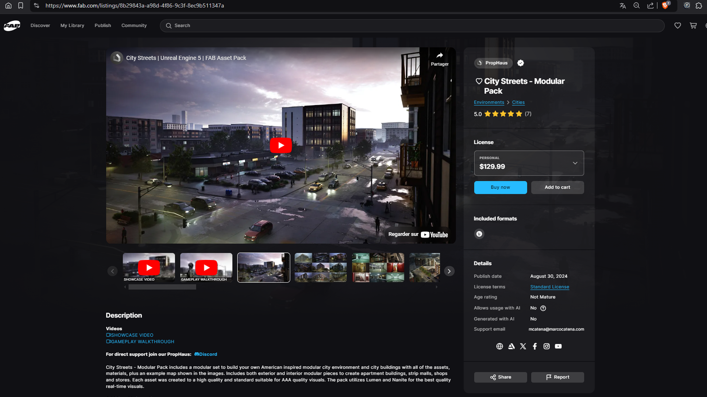

# Fab Extended
This extension adds new features and improves the user experience on the Fab website.

## Features
- Favorites (Button on product page, Button on thumbnails, Button/Menu in navbar, Search bar)
- Add To Cart button on thumbnails
- Bring back Technical Details on file format
- Auto-select License (Automatically selects the personal license, if this is not possible, the first license will be selected)
- Video Player (Get videos from a product description to display directly in the carousel with other images)
- Logo of well-known sites in a product description
- The seller's support email is displayed directly in the product details.
- Settings Page (Modify extension settings to improve your experience)

## Images
- Product page

- Button on thumbnails
  

- Button/Menu in navbar

- Extension Popup
  

- Settings
  
